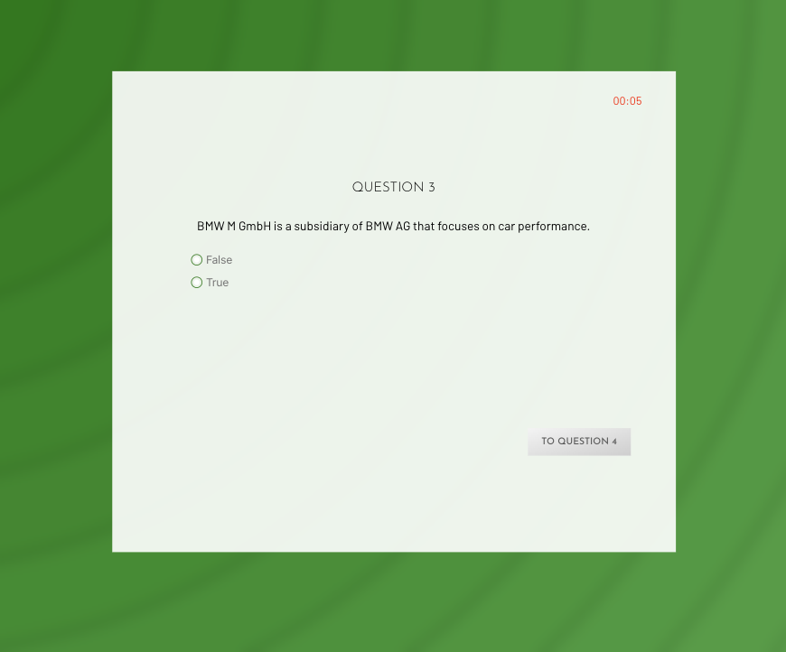

# Quizzaly

Quizzaly is a quiz app built using react.js and Firebase as the Realtime Database. The app features quite a lot of tracks and allows for difficulty, mode of options and number of questions preferences. There is also an active leaderboard to players. Can you claim a spot on the top 10 leaderboard? Why not take your chance here [https://quizzaly.netlify.app/](https://quizzaly.netlify.app/)

## Live Demo




## Run Locally

Clone the project

```bash
  git clone https://github.com/Tiskae/quizzaly.git
```

Go to the project directory

```bash
  cd quizzaly
```

Install dependencies

```bash
  npm install
```

Start the server then open in your browser

```bash
  npm run start
```

Build the project

```
  npm run build
```

## Features ✨

- 📚 Fetches random questions from OpenTriviaDB API
- ⏳ Countdown timer for each question
- 📊 Score calculation and results summary
- 🔧 Customizable quiz preferences (difficulty, category, etc.)
- 📱 Responsive design for all devices
- 🔄 React Router for smooth navigation

## Project Structure

```
quizzaly/
├── public/               # Static files
├── src/
│   ├── assets/           # Asset files e.g. images
│   ├── components/       # Reusable UI components
│   ├── containers/       # Main page components
│   ├── Context/          # React context providers
│   ├── Helpers/          # Helper functions and global constants
│   ├── hoc/              # Higher order functions
│   ├── styles/           # Global styles
│   ├── UI/               # Reusable lean UI elements e.g. buttons
│   ├── App.js            # Main app component
│   └── index.js          # Entry point
├── package.json
└── README.md
```

## Technologies Used 🛠️

- **Frontend**: React, React Router
- **Database**: Firebase Cloud Store
- **Styling**: CSS Modules
- **HTTP Client**: Axios
- **Build Tool**: Create React App
- **Deployment**: Netlify

## API Reference

The questions for the quiz are sourced from [OpenTriviaDB](https://opentdb.com/), a free to use, user-contributed trivia question database with 4,600+ verified questions.

## Authors

This project is fully designed and developed by [@tiskae](https://www.github.com/tiskae)
